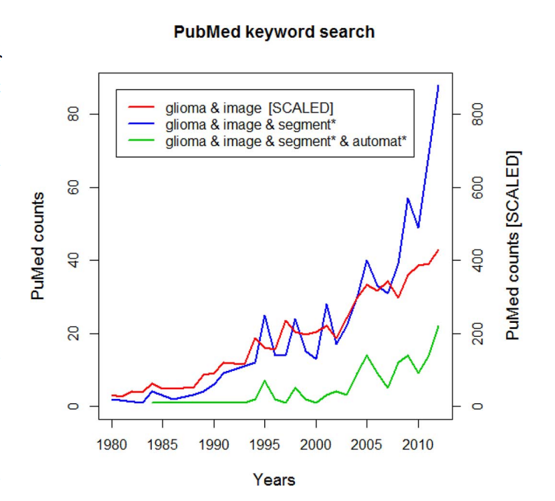

# Braindon

## Team Members
Zhuoheng Huang, Junming Zhang, Yongzhao Wu, Fei Ju

## Distribution of responsibilities in the group
- Zhuoheng developed a preprocessing routine to extract the nii.gz files and visualize MRI images.
- Junming and Zhuoheng have crafted up to refer to the TwoPathCNN model and the renovation plan to increase the accuracy and speed of tumor detection.
- Fei provides an outline of the general model architecture, managing computational resources, and contacting MICCAI for the dataset permission.
- Yongzhao helped to collect models and resources available regarding our dataset online for possible improvement on the performance, and implement the loss function and model optimization details.

## Name of Dataset
We are recently searching for the vast majority of datasets and finally determined to use Brain Tumour Segmentation Challenge 2017 (BraTS 2017). 

## Paper References
- Dataset and benchmark introduction
  - The Multimodal Brain Tumor Image Segmentation Benchmark (BRATS) (https://ieeexplore.ieee.org/stamp/stamp.jsp?tp=&arnumber=6975210)
- Model examples
  - Ensembles of Multiple Models and Architectures for Robust Brain Tumour Segmentation (https://arxiv.org/pdf/1711.01468.pdf)
  - Automatic Brain Tumor Segmentation using Cascaded Anisotropic Convolutional Neural Networks (https://arxiv.org/pdf/1709.00382.pdf)
  - Brain Tumor Segmentation and Radiomics Survival Prediction: Contribution to the BraTS 2017 Challenge (https://arxiv.org/pdf/1802.10508.pdf)

## Location of the Dataset
The dataset is available on kaggle, https://www.kaggle.com/xxc025/unet-datasets. 

## Reasons for choosing the dataset
There are few reasons why BraTS 2017 stands out among all other datasets.  First, we want to investigate the topic of brain tumor detection and segmentation by algorithm, which has been a hot medical science topic today. The trend below illustrates the situation and a description is attached below [1].

BraTS 2017 is the dataset that best matches our expectations. Each sample in this dataset is one brain segmentation annotated by experts. The image above shows some of the annotations in the dataset[1].

BraTS 2017 contains 42 GB data in total, with more than 300 samples, which means it has numerous samples for training, testing, and validation purposes. The second reason is that all samples are in the NIfTI analysis format, which is efficient for loading and fetching the necessary metadata for each sample. The last reason is that each label has 4 modalities (T1, T1Gd, T2 and FLAIR), which corresponds with the MRI scans, so the model may have better performance in real life application. 

## Who has started to access (download) the dataset?
Zhuoheng has downloaded the chosen dataset.

## Who setup the source code repo?
Zhuoheng set up the GitHub repository at https://github.com/Angeloschert/CSC490_Braindon

## Distribution of tasks for this report
All teammates came up with the team name and found the dataset together. Zhuoheng distributed responsibilities for each team member. Junming and Zhuoheng found the location of the dataset BraTS 2018 and BraTS 2017 respectively, and then downloaded them. We finally adopted the dataset BraTS 2017, downloaded by Zhuoheng, and Zhuoheng also set up the dataset for source code. Yongzhao and Fei worked together to find paper references about the dataset and modeling. Junming figured the reasons for our dataset choice. 

## Reference
[1] B. H. Menze et al., "The Multimodal Brain Tumor Image Segmentation Benchmark (BRATS)," in IEEE Transactions on Medical Imaging, vol. 34, no. 10, pp. 1993-2024, Oct. 2015, doi: 10.1109/TMI.2014.2377694.
