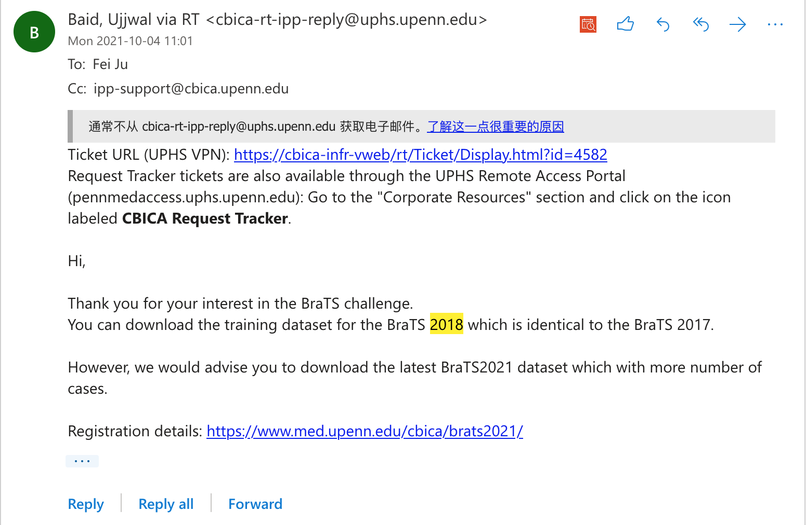

# Braindon

# Project background

Project background was introduced in previous [README.md](background.md).

Further more, our project were based on this [this repo](https://github.com/taigw/brats17/), which won the second place in BraTS 2017. We follow the original model for the config setup and extraction, and we did minor modifications in ``util/``, and major/completely rework on other files.

# Data

The data is available [here](https://utoronto-my.sharepoint.com/:u:/g/personal/yongzhao_wu_mail_utoronto_ca/ESqDxzWXkY5MoC3TDEliohQB3DCVO01rNCgNhstAb4lbRA?e=D0Zvw8). Make sure you've logged in to U of T account.

The data contains all BraTS 2017, with 10 samples from BraTS 2020 as test set.

**Note 1**: The name of folders in the data shows "BraTS 2018", that's because the official suggested us to use BraTS 2018 when we sending inquires regrading downloading BraTS 2017. They also confirmed that BraTS 2018 is identical with BraTS 2017.



**Note 2**: The data will be 24 GB after unzip.

# How to run the code?

## 1. Update config files to match your setup

If you are going to use the model to test/train with some examples, update ``data_root`` and ``data_names`` in config files in ``config17``. 

``data_root`` should be an absolute path to the data directory (so that there will be 3 folders under the path, HGG, LGG and 2020). 

``data_names`` should be an absolute path to the test data names. In our case, it should be ``test_names.txt``  or ``train_names.txt``, depends on your need, under folder ``config17``.  


## 2. Install required packages

All packages are in ``requirements.txt`` and available on ``pip``. 

## 3. Run the model

Training
-----

There are 3 tasks, and 3 views for each of them, so 9 models in total. 

For example, if you want to train model for *whole tumor* with *axial* view, then you can run the following line:

```
python train.py config17/train_wt_ax.txt
```

Testing
----- 


The following section will demonstrate how to run brain tumor segmentation with our model. After this section, segmentation result in ``.nii.gz`` format in ``result17``.

Testing Setup
-----
First, you have to **update** the model directory( ``model_file``) in ``config17/test_all.txt``. 

In our repo, we provided 18 models in two types:

 trained with **augmented** data and trained with **original** data.

 Models name that ends with ``_da`` are the models trained with **augmented** data, and others are trained with original data.

There are two configs for testing in the ``config17``, which are ``config17/test_all.txt`` and ``config17/test_all_da.txt``, which are for original data and augmented data, respectively. 


 Also, make sure that directory **result17** exists under project root folder.

Testing Model
------

As mentioned above, there are two configs, the following examples will be using original data. Change ``test_all.txt`` to ``test_all_da.txt`` if you want to test with model trained with augmented data. 

 After all configs are done, the model can be test **with CRF** with following line:

 ```
 python test.py config17/test_all.txt crf
 ```

 If you **don't want CRF** in your test result, run the following line:

 ```
 python test.py config17/test_all.txt
 ```

Evaluate Model
-----

If you want to evaluate the accuracy of the model, make sure you have **completed the testing** step above.

The evaluation can be simply done with the following line:

```
 python evaluation.py config17/test_all.txt
```

The accuracy will be printed.


# 4. Result

The performance for the model in testing set are the following:

<table>
   <tr>
      <td></td>
      <td>Original Model</td>
      <td></td>
      <td></td>
      <td>CRF + Augmented</td>
      <td></td>
      <td></td>
   </tr>
   <tr>
      <td></td>
      <td>ET</td>
      <td>WT</td>
      <td>TC</td>
      <td>ET</td>
      <td>WT</td>
      <td>TC</td>
   </tr>
   <tr>
      <td>Mean</td>
      <td>63.92</td>
      <td>91.72</td>
      <td>80.59</td>
      <td>76.38</td>
      <td>88.93</td>
      <td>81.68</td>
   </tr>
   <tr>
      <td>STD</td>
      <td>30.63</td>
      <td>5.82</td>
      <td>18.15</td>
      <td>25.93</td>
      <td>8.88</td>
      <td>13.24</td>
   </tr>
   <tr>
      <td></td>
   </tr>
</table>

**Note**: We used different validation set compare to the original work, as that the validation set for BraTS 2018 does not contain segmentation for us to evaluate the accuracy. Also, the author indicated that they use a much larger batchsize and training iteration than what they release on GitHub. As the result, our implementation accuracy does not exactlly match the accuracy on the paper.

### Sample segmentation


Reference
-----

### Repository
[1] taigw, brats17 (2019), GitHub repository, https://github.com/taigw/brats17</br>
[2] Jun Ma, SegLoss (2021), GitHub repository, https://github.com/JunMa11/SegLoss</br>
[3] Mikhail Goncharov, crfseg (2021), Github repository, https://github.com/migonch/crfseg</br>
[4] Fernando Pérez-García, torchio (2021), GitHub repository, https://github.com/fepegar/torchio</br>

### Dataset
[1] B. H. Menze, A. Jakab, S. Bauer, J. Kalpathy-Cramer, K. Farahani, J. Kirby, et al. "The Multimodal Brain Tumor Image Segmentation Benchmark (BRATS)", IEEE Transactions on Medical Imaging 34(10), 1993-2024 (2015) DOI: 10.1109/TMI.2014.2377694<br/>
[2] S. Bakas, H. Akbari, A. Sotiras, M. Bilello, M. Rozycki, J.S. Kirby, et al., "Advancing The Cancer Genome Atlas glioma MRI collections with expert segmentation labels and radiomic features", Nature Scientific Data, 4:170117 (2017) DOI: 10.1038/sdata.2017.117<br/>
[3] S. Bakas, M. Reyes, A. Jakab, S. Bauer, M. Rempfler, A. Crimi, et al., "Identifying the Best Machine Learning Algorithms for Brain Tumor Segmentation, Progression Assessment, and Overall Survival Prediction in the BRATS Challenge", arXiv preprint arXiv:1811.02629 (2018)<br/>
[4] S. Bakas, H. Akbari, A. Sotiras, M. Bilello, M. Rozycki, J. Kirby, et al., "Segmentation Labels and Radiomic Features for the Pre-operative Scans of the TCGA-GBM collection", The Cancer Imaging Archive, 2017. DOI: 10.7937/K9/TCIA.2017.KLXWJJ1Q<br/>
[5] S. Bakas, H. Akbari, A. Sotiras, M. Bilello, M. Rozycki, J. Kirby, et al., "Segmentation Labels and Radiomic Features for the Pre-operative Scans of the TCGA-LGG collection", The Cancer Imaging Archive, 2017. DOI: 10.7937/K9/TCIA.2017.GJQ7R0EF<br/>

### Paper
[1] Gibson, E., Li, W., Sudre, C., Fidon, L., Shakir, D. I., Wang, G., Eaton-Rosen, Z., Gray, R., Doel, T., Hu, Y., Whyntie, T., Nachev, P., Modat, M., Barratt, D. C., Ourselin, S., Cardoso, M. J., & Vercauteren, T. (2018). NiftyNet: a deep-learning platform for medical imaging. Computer Methods and Programs in Biomedicine, 158, 113–122. https://doi.org/10.1016/j.cmpb.2018.01.025<br/>
[2] Ma, J., Chen, J., Ng, M., Huang, R., Li, Y., Li, C., Yang, X., & Martel, A. L. (2021). Loss odyssey in medical image segmentation. Medical Image Analysis, 71, 102035. https://doi.org/10.1016/j.media.2021.102035<br/>
[3] Pérez-García, F., Sparks, R., & Ourselin, S. (2021). TorchIO: A Python library for efficient loading, preprocessing, augmentation and patch-based sampling of medical images in deep learning. Computer Methods and Programs in Biomedicine, 208, 106236. https://doi.org/10.1016/j.cmpb.2021.106236<br/>
[4] Philipp Krähenbühl, & Vladlen Koltun. (2012). Efficient Inference in Fully Connected CRFs with Gaussian Edge Potentials.<br/>
[5] Wang, G., Li, W., Ourselin, S., & Vercauteren, T. (2018). Automatic Brain Tumor Segmentation Using Cascaded Anisotropic Convolutional Neural Networks. Brainlesion: Glioma, Multiple Sclerosis, Stroke and Traumatic Brain Injuries, 178–190. https://doi.org/10.1007/978-3-319-75238-9_16<br/>
[6] Zheng, S., Jayasumana, S., Romera-Paredes, B., Vineet, V., Su, Z., Du, D., Huang, C., & Torr, P. H. S. (2015). Conditional Random Fields as Recurrent Neural Networks. 2015 IEEE International Conference on Computer Vision (ICCV). Published. https://doi.org/10.1109/iccv.2015.179
